# 09 - UTS

## UTS Komputasi Awan

Untuk MK Komputasi Awan nanti tidak ada kelas daring & info dr Puskom portal/LMS sdg pemeliharaan server.
Agenda hari ini diganti UTS dg spesifikasi use case spt berikut:

Silakan masing-masing individu memanfaatkan object storage sebagai media penyimpanan assets (gambar, file2 upload, dsb) berdasarkan project Kuis 1 kemarin yaitu aplikasi Wordpress.
Sehingga hasil akhir utk UTS aplikasi dpt memanfaatkan VM, DB instance dan Object Storage.
Buatlah laporan di masing-masing repo private GitHub Anda!
Deadline 2 Nov 2021 Jam 07:00 WIB.

## Hasil UTS

1. Login ke oracle cloud jika sudah di dasboard pilih menu storage selanjutnya pilih buckets.

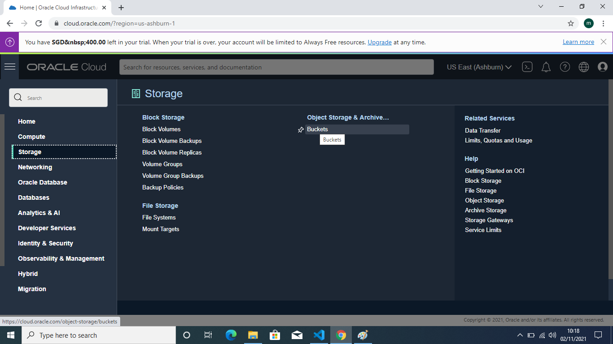

2. Jika Sudah di halaman buckets klik button create buckets  

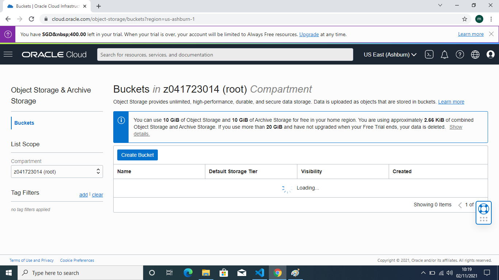

3. isikan nama buckets jika sudah diisikan klik button create untuk membuat buckets baru.

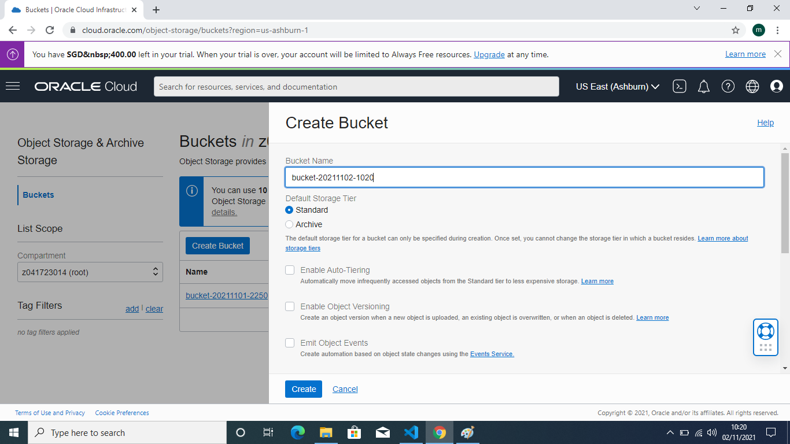

4. Buckets telah berhasil di buat tapi masih berstatus private belum terpublikasi. 

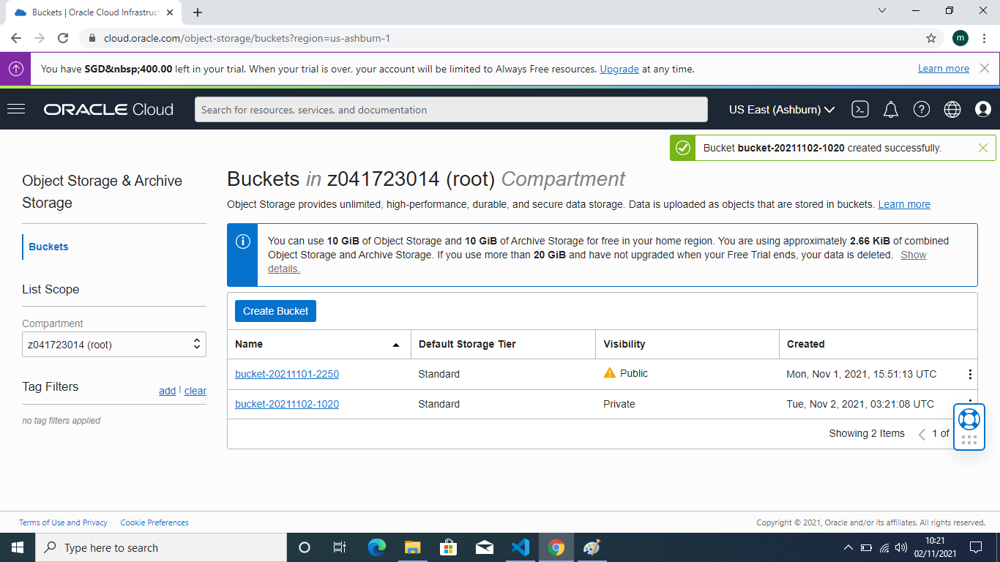

5. jika ingin mengubah statusnya menjadi publik maka pilih project buckets yang akan di ubah klik setting di pojok kanan pilih view bucket details

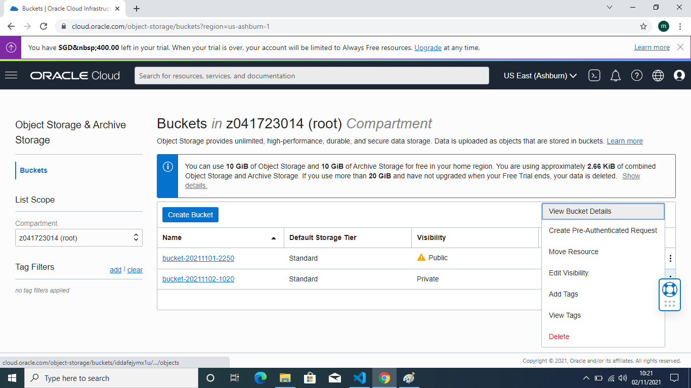

6. jika sudah berada di dalam detail buckets pilih edit visibility ganti private menjadi public kemudia klik button save changes  

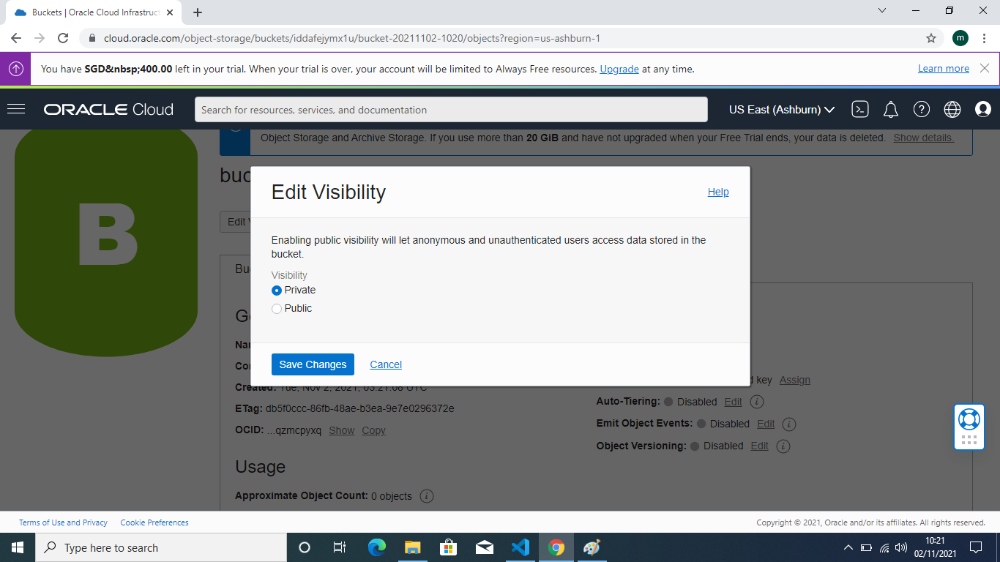

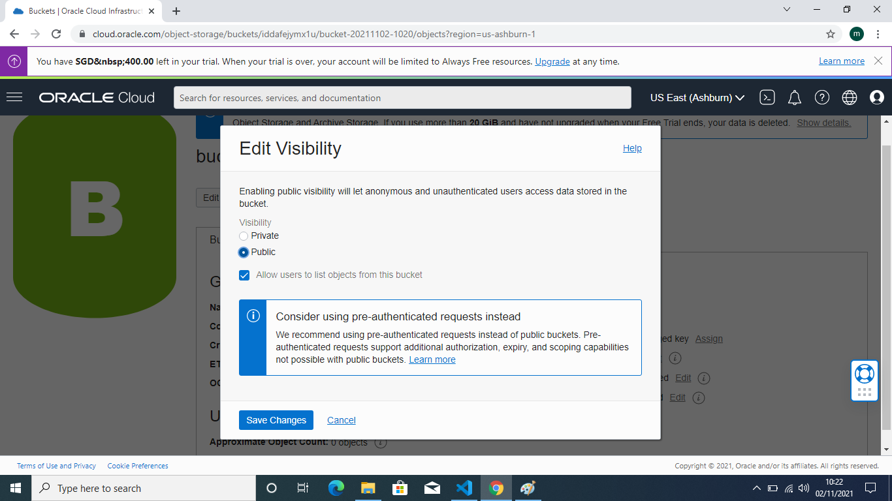

7. Selanjutnya ke halaman objects lalu klik button upload untuk mengupload file objects yang akan di tampilkan

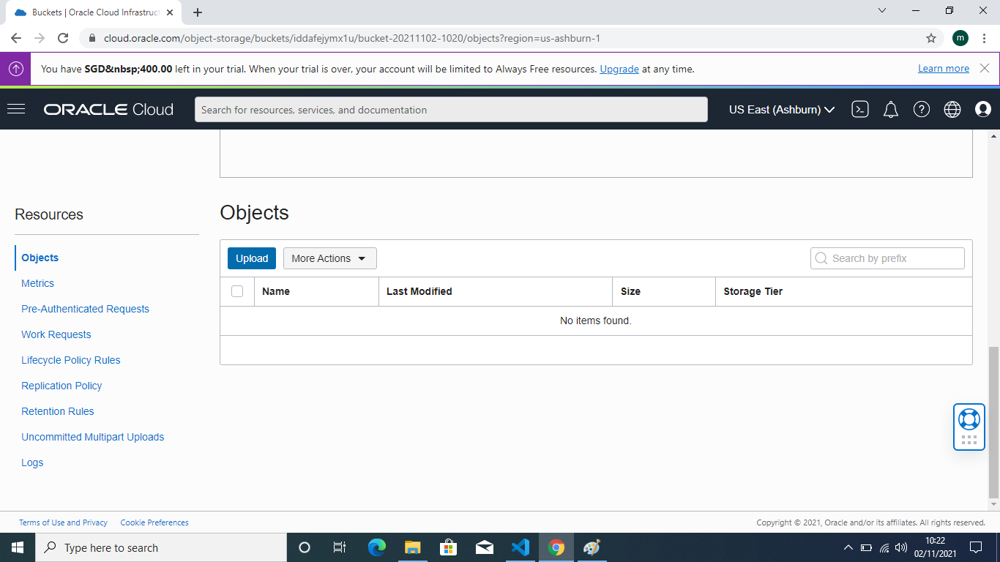

8. dibawah ini adalah halaman untuk upload object pilih drop files/select files

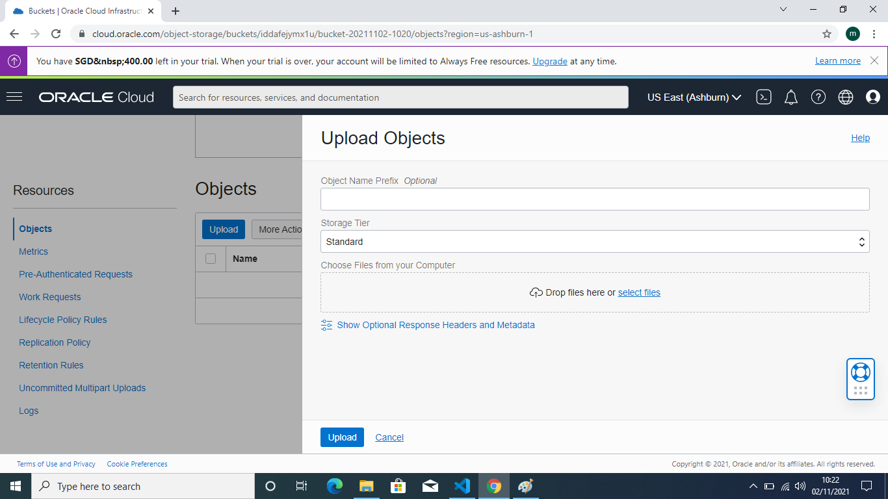

9. file yang telah kita upload tadi sudah berhasil tampil di halaman objects untuk melihat objects lebih detail kita klik setting di bagian pojok kanan kemudian klik views detail objects

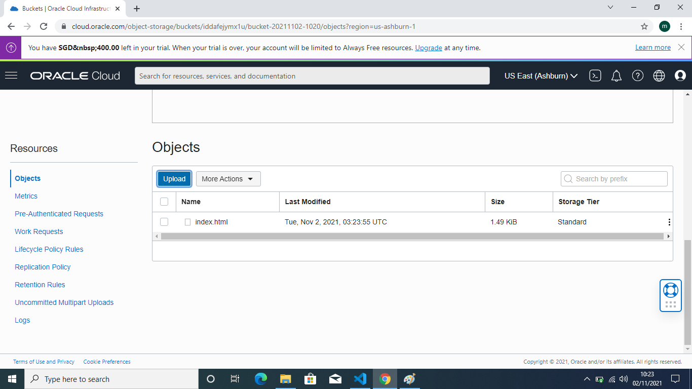

10. di halaman objects detail terdapat informasi file yang telah kita upload tadi dan link url telah muncul.

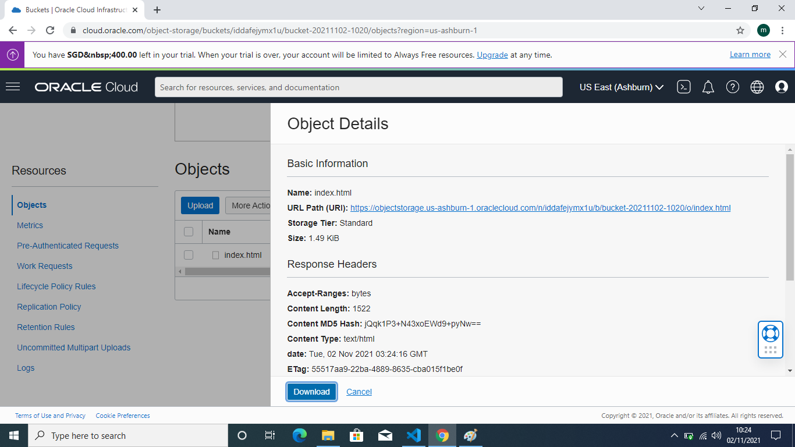

11. selanjutnya klik link url path maka akan menampilkan tampilan seperti di bawah ini tandanya object berhasil di buat 

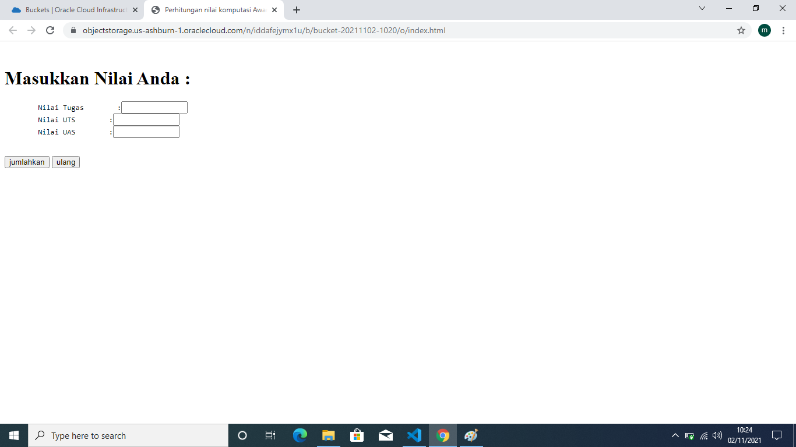

Link : https://objectstorage.us-ashburn-1.oraclecloud.com/n/iddafejymx1u/b/bucket-20211102-1020/o/index.html
